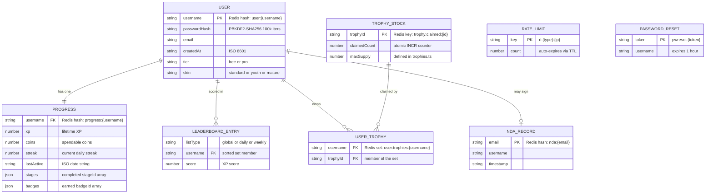
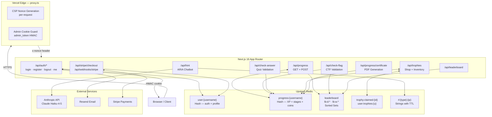
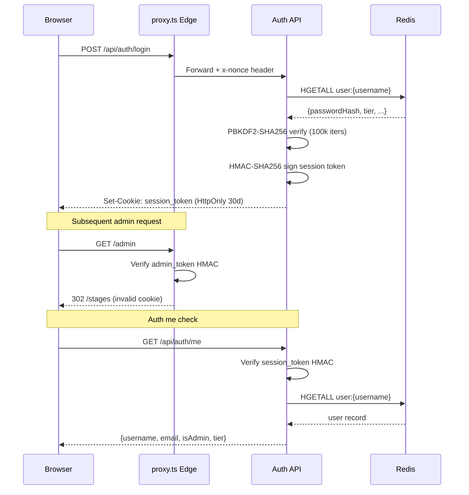
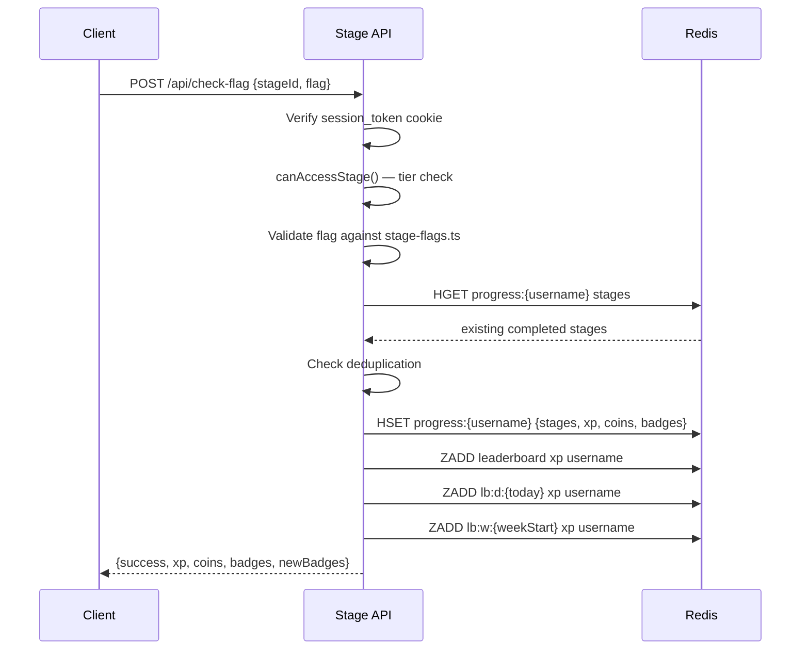
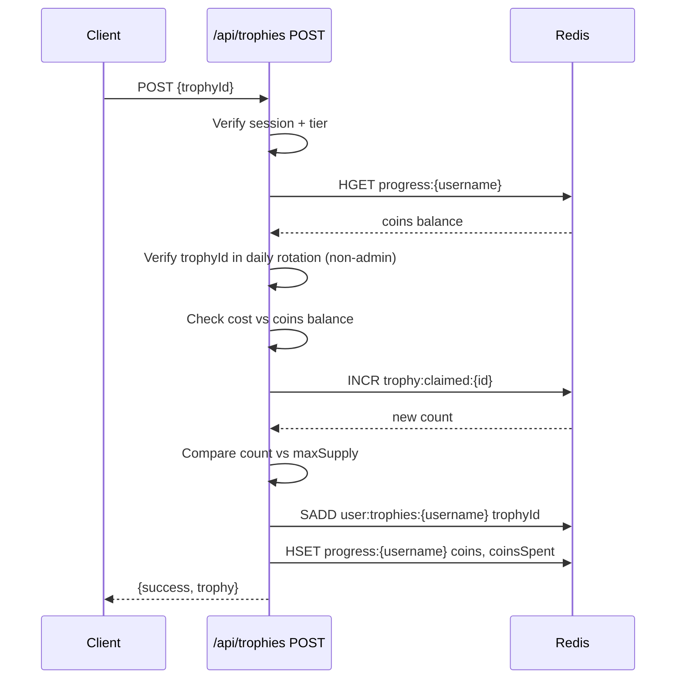

# Data Diagram — Kryptós CronOS

**Version:** v1.0.0
**Last Updated:** 2026-05-26
**Status:** Current

All persistent state lives in Upstash Redis. There is no relational database. The diagrams below model logical entities, Redis key schemas, data flow, and session/XP update sequences.

---

## Entity Relationship Model

---

## Redis Key Inventory

| Key Pattern | Type | TTL | Purpose |
|---|---|---|---|
| `user:{username}` | Hash | None | User record — auth fields + profile |
| `progress:{username}` | Hash | None | XP, coins, stages, badges, streak |
| `leaderboard` | Sorted Set | None | All-time XP ranking |
| `lb:d:{YYYY-MM-DD}` | Sorted Set | 8 days | Daily XP ranking |
| `lb:w:{YYYY-MM-DD}` | Sorted Set | 35 days | Weekly XP ranking |
| `trophy:claimed:{id}` | String | None | Atomic supply reservation counter |
| `user:trophies:{username}` | Set | None | Owned trophy IDs |
| `nda:{email}` | Hash | None | NDA signatory record |
| `nda:token:{token}` | String | 7 days | NDA verification token |
| `pwreset:{token}` | String | 1 hour | Password reset token |
| `rl:forgot:{ip}` | String | 15 min | Forgot-password rate limit (3/15min) |
| `rl:login:{ip}` | String | 15 min | Login rate limit (5/15min) |
| `rl:register:{ip}` | String | 1 hour | Registration rate limit (5/hr) |
| `rl:hint:{username}` | String | 30 sec | ARIA hint cooldown (free tier) |
| `feedback:{timestamp}` | Hash | 90 days | User feedback submissions |

---

## System Data Flow

---

## Authentication & Session Flow

---

## XP Award & Leaderboard Update Flow

---

## Trophy Purchase Flow

---

## Progress Hash Schema

The `progress:{username}` hash stores all gameplay state for a user. Fields:

| Field | Type | Notes |
|---|---|---|
| `xp` | number string | Lifetime XP total |
| `coins` | number string | Spendable coin balance |
| `coinsSpent` | number string | All-time coins spent |
| `streak` | number string | Current daily login streak |
| `lastActive` | string | ISO date of last stage completion |
| `stages` | JSON string | `string[]` of completed stageIds |
| `badges` | JSON string | `string[]` of earned badgeIds |

---

## Badge ID Conventions

| Badge ID | Trigger |
|---|---|
| `m-xp-1k` | 1,000 XP milestone |
| `m-xp-5k` | 5,000 XP milestone |
| `m-xp-10k` | 10,000 XP milestone |
| `m-streak-3` | 3-day streak |
| `m-streak-7` | 7-day streak |
| `m-streak-30` | 30-day streak |

Badges are awarded server-side in `server-progress.ts` `awardStageInRedis()` and stored in `progress:{username}` badges array.
