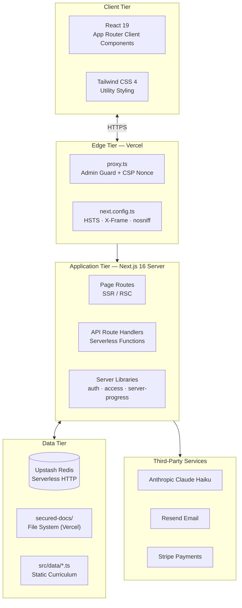
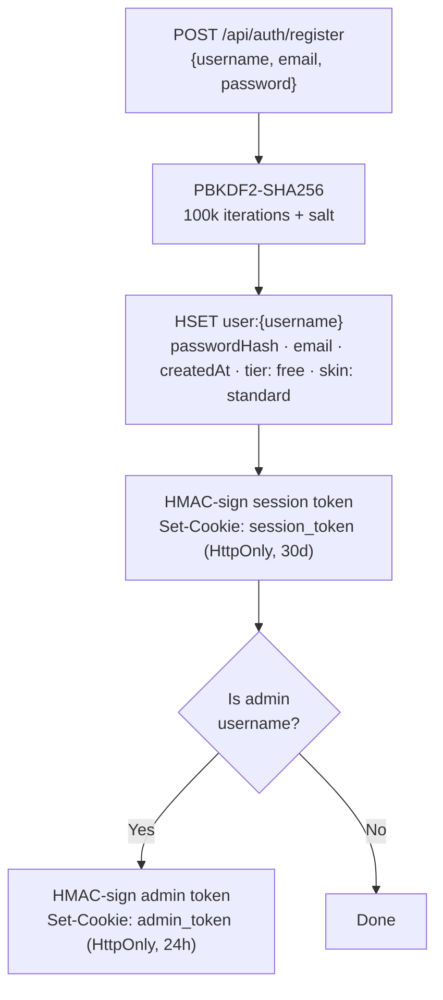
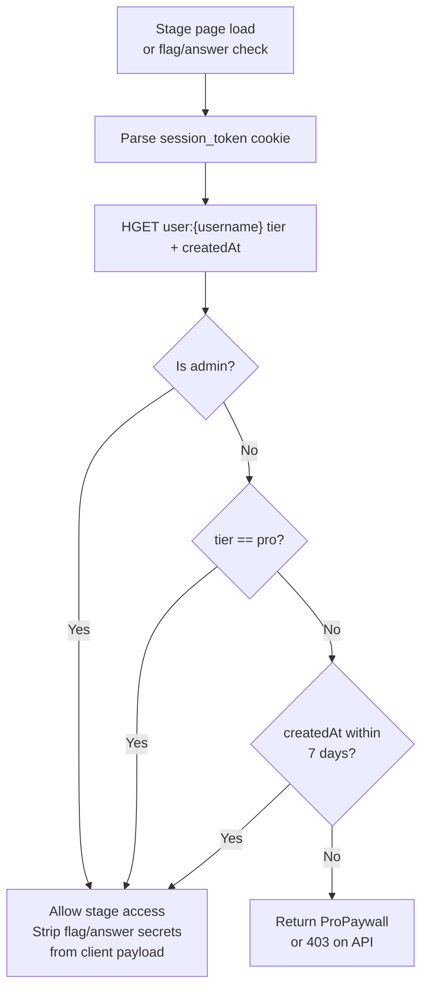

# Technical Design Document — Kryptós CronOS

**Version:** v1.0.0
**Last Updated:** 2026-05-26
**Status:** Current

---

## 1. System Architecture



---

## 2. Key Design Decisions

### 2.1 Middleware as `proxy.ts` (not `middleware.ts`)

Next.js 16 with Turbopack requires the middleware export to be named `proxy`. The active middleware file is `src/proxy.ts`. Renaming to `middleware.ts` would break admin route protection in production.

### 2.2 Redis as Sole Database

All persistent state lives in Upstash Redis. This choice eliminates cold-start overhead from database connection pooling in serverless environments. The trade-off is a schemaless, eventually-consistent data model — acceptable for the current scale.

### 2.3 Server-Side XP Computation

Client-submitted XP is ignored. The server maintains a `STAGE_XP` map keyed by stageId. All XP awards are computed from this server-side map, preventing any client-side manipulation.

### 2.4 `server-only` Flag Store

`src/data/stage-flags.ts` imports `server-only` which causes a build error if this module is accidentally imported in a client component. CTF flag values never reach the browser.

### 2.5 Nonce-Based CSP

Every request generates a fresh cryptographic nonce in `proxy.ts`. The nonce is passed via the `x-nonce` response header, read by `layout.tsx` to apply to the anti-FOUC inline script. This eliminates `unsafe-inline` from the script-src CSP directive.

### 2.6 HMAC Cookie Sessions

Session tokens are `{username}:{HMAC-SHA256(username, SESSION_SECRET)}` stored in a 30-day HttpOnly cookie. Admin tokens follow the same pattern with `ADMIN_SECRET` and a 24-hour expiry. There is no server-side session store — verification is stateless.

---

## 3. Authentication Design



**Token format:** `{username}:{hex(HMAC-SHA256(username, secret))}`

**Verification:** `timingSafeEqual` comparison against freshly computed HMAC to prevent timing attacks.

---

## 4. Tier Enforcement Design



`canAccessStage()` in `src/lib/access.ts` implements this logic. It is called in:
- `/api/check-flag` (before revealing flag validation result)
- `/api/check-answer` (before validating answer)
- Stage page server component (before rendering CTF/quiz config)

---

## 5. Leaderboard Design

Three Redis sorted sets maintained in parallel:

```
leaderboard               → all-time XP (no expiry)
lb:d:{YYYY-MM-DD}         → daily XP (8-day TTL)
lb:w:{YYYY-MM-DD}         → weekly XP keyed by week start (35-day TTL)
```

On every stage award, `ZADD ... INCR` atomically adds the XP delta to the member's current score. The `/api/leaderboard` route reads ZREVRANGE with scores for all three sets and joins them for the response.

---

## 6. Trophy System Design

**Supply curve:**

| Tier | Max Supply |
|---|---|
| Field | 50,000 |
| Enlisted | 10,000 |
| Commended | 2,500 |
| Decorated | 500 |
| Distinguished | 100 |
| Elite | 25 |
| Legendary | 5 |
| Apex | 1 |

**Daily rotation:** Fisher-Yates shuffle seeded by `hashString(username + dayNumber)`. Each user sees a deterministic but unique daily set of 10 trophies. The shop refreshes at UTC midnight.

**Atomic purchase:**
1. `INCR trophy:claimed:{id}` — reserve atomically
2. Compare new count vs `maxSupply`
3. If over supply: `DECR trophy:claimed:{id}` — release reservation; return 409
4. If within supply: `SADD user:trophies:{username} {id}` + deduct coins

---

## 7. CI/CD Design

```mermaid
flowchart LR
    DevWork["Feature Work\nlocal dev branch"]
    PushDev["git push → dev"]
    CI["GitHub Actions CI\nlint + tsc + build + audit"]
    PreviewURL["Vercel Preview URL\ndev branch"]
    Test["Test on Preview\nlive Redis + Resend stack"]
    MergePR["Merge dev → master"]
    CIProd["CI again on master"]
    ProdDeploy["Vercel Production\nkryptoscronos.com"]

    DevWork --> PushDev
    PushDev --> CI
    CI --> PreviewURL
    PreviewURL --> Test
    Test --> MergePR
    MergePR --> CIProd
    CIProd --> ProdDeploy
```



**CI gates (must all pass before merge):**
1. `eslint` — 0 errors
2. `tsc --noEmit --skipLibCheck` — 0 type errors
3. `next build` — production build completes
4. `npm audit` — no critical vulnerabilities

---

## 8. Document Serving Design

Internal documentation is served through a secure API route:

```
Admin browser → GET /api/docs/{filename}
             → Verify admin_token HMAC cookie
             → Check filename in ALLOWED_FILES allowlist
             → Read from secured-docs/ (not public/)
             → Return text/plain
```

Files in `secured-docs/` are included in the Vercel deployment bundle via `outputFileTracingIncludes` in `next.config.ts`. They are never accessible directly via URL — only through the authenticated API route.

---

## 9. Email Design

Three email flows via Resend (`noreply@kryptoscronos.com`):

| Trigger | Template | Recipient |
|---|---|---|
| New user registration | Welcome email — 438 stages, 36 epochs, trial info | New user + admin alert to `hello@kryptoscronos.com` |
| Password reset request | Reset link with 1-hour expiry token | User's registered email |
| Stage completion (new) | XP, badge, streak, next-stage link | User's registered email |

All email sends are fire-and-forget (non-blocking). Failures are logged but do not fail the originating request.

---

## 10. Content Security Policy Design

```
script-src  'nonce-{per-request-nonce}' 'strict-dynamic'
style-src   'self' 'unsafe-inline'
img-src     'self' data: blob:
connect-src 'self' https://api.anthropic.com https://api.resend.com https://js.stripe.com
frame-src   https://js.stripe.com
```

Nonce is generated in `proxy.ts` via `crypto.getRandomValues()` and passed as:
- Response header: `x-nonce: {nonce}` (read by `layout.tsx` for anti-FOUC script)
- CSP header: `Content-Security-Policy: script-src 'nonce-{nonce}'...`

---

## 11. Error Handling Strategy

| Layer | Strategy |
|---|---|
| API routes | Return typed JSON `{ error: string }` with appropriate HTTP status |
| Redis calls | Propagate errors as 500; individual route decides whether to surface or suppress |
| Stripe webhooks | Return 200 immediately; idempotent Redis writes |
| Email sends | Fire-and-forget; caught exceptions logged, not re-thrown |
| Client fetch | `try/catch` in `useEffect`; display user-facing error state |
| PBKDF2 | Synchronous — errors propagate as 500 to caller |
