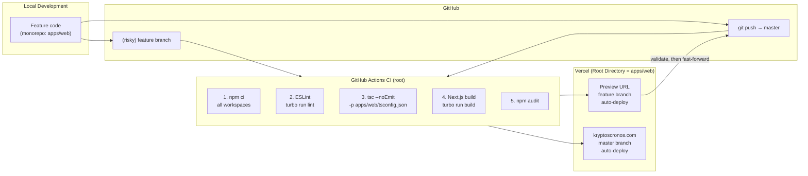
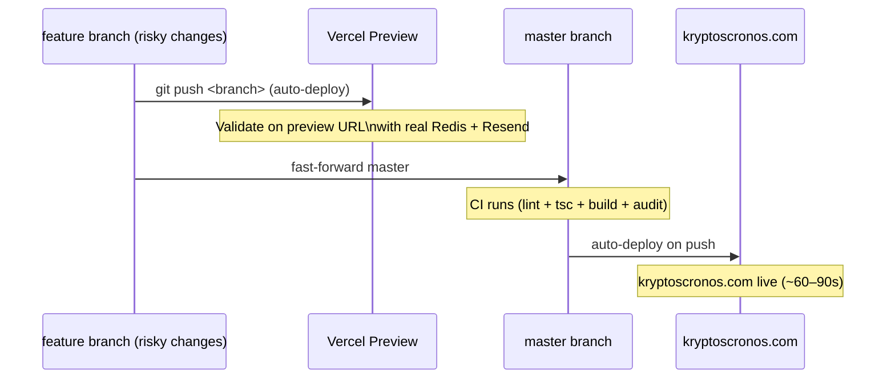

# CI/CD Pipeline — Kryptós CronOS

**Version:** v2.0.0
**Last Updated:** 2026-06-03
**Status:** Current

---

## 1. Pipeline Overview



---

## 2. Branch Strategy

| Branch | Purpose | CI Trigger | Vercel Target |
|---|---|---|---|
| `master` | Single source of truth + production | Push + PR | kryptoscronos.com |
| `<feature>/*` | Short-lived branches for risky/structural changes | Push | Preview URL |

**Workflow (single-branch, as of 2026-06-03):** push to `master` → CI + Vercel auto-deploy to production. For risky changes, push a short-lived feature branch, validate the Vercel **Preview** build, then fast-forward `master` and delete the branch. The old `dev` branch was retired. CI runs from the **monorepo root** (`npm ci` + workspace-scoped lint/typecheck/build); Vercel Root Directory = `apps/web`. The mobile app (`apps/mobile`) is built/shipped separately via **EAS**, not by Vercel.

---

## 3. GitHub Actions Workflow

**File:** `.github/workflows/ci.yml` — runs from the repo root (npm workspaces + Turborepo).

```yaml
name: CI

on:
  push:
    branches: [master]
  pull_request:
    branches: [master]

jobs:
  build:
    runs-on: ubuntu-latest

    steps:
      - uses: actions/checkout@v4

      - uses: actions/setup-node@v4
        with:
          node-version: "24"
          cache: "npm"
          cache-dependency-path: package-lock.json

      - name: Install dependencies
        run: npm ci                       # installs ALL workspaces

      - name: Lint
        run: npm run lint                 # turbo run lint → @kryptos/web

      - name: Type check
        run: npx tsc --noEmit --skipLibCheck -p apps/web/tsconfig.json

      - name: Build
        run: npm run build                # turbo run build → @kryptos/web
        env:
          UPSTASH_REDIS_REST_URL: ${{ secrets.UPSTASH_REDIS_REST_URL }}
          UPSTASH_REDIS_REST_TOKEN: ${{ secrets.UPSTASH_REDIS_REST_TOKEN }}
          RESEND_API_KEY: ci-placeholder
          ADMIN_EMAIL: ci-placeholder
          ADMIN_USERNAME: ci-placeholder
          ADMIN_SECRET: ci-placeholder-secret-32-characters!!
          SESSION_SECRET: ci-placeholder-secret-32-characters!!
          ANTHROPIC_API_KEY: ci-placeholder
          STRIPE_SECRET_KEY: ci-placeholder
          STRIPE_WEBHOOK_SECRET: ci-placeholder
          STRIPE_PRO_MONTHLY_PRICE_ID: ci-placeholder
          STRIPE_PRO_YEARLY_PRICE_ID: ci-placeholder
          SUPABASE_URL: ci-placeholder
          SUPABASE_ANON_KEY: ci-placeholder
          SUPABASE_SERVICE_ROLE_KEY: ci-placeholder
          REVENUECAT_WEBHOOK_AUTH: ci-placeholder
          CRON_SECRET: ci-placeholder

      - name: Security audit
        run: npm audit --audit-level=critical
```

**GitHub Secrets required:**
- `UPSTASH_REDIS_REST_URL` — needed for the actual build (Redis client initializes at build time)
- `UPSTASH_REDIS_REST_TOKEN` — same

All other env vars are stubbed with `ci-placeholder` for the build step. The build must succeed with stubs — all env var access must be lazy (inside route handlers, not at module load time). `supabaseAdmin` is a lazy Proxy for exactly this reason (Preview env lacks Supabase vars).

---

## 4. Vercel Configuration

**Project name:** `kryptos-cronos` (must include `--project kryptos-cronos` flag on manual CLI deploys)

**Branch mapping:**
| Branch | Environment | URL |
|---|---|---|
| `master` | Production | kryptoscronos.com |
| `<feature>/*` | Preview | `kryptos-cronos-git-<branch>-*.vercel.app` |

**Build settings (Vercel dashboard):**
- Framework: Next.js (auto-detected)
- **Root Directory: `apps/web`** with **"Include files outside the root directory" ON** (needed for the workspace root lockfile)
- Build command: `npm run build`
- Output directory: `.next`
- Node version: 24.x

**All environment variables** set in Vercel → Project → Settings → Environment Variables for Production (and optionally Preview). Note: the **Preview** environment intentionally lacks the Supabase vars — `supabaseAdmin` is lazily constructed so Preview builds still succeed.

---

## 5. Manual Deploy Procedure

When deploying from the CLI (e.g., after a hotfix):

```bash
cd C:\Users\Ajax\Projects\cyberquest

# Step 1: Run CI gates locally (turbo, from root)
npm run lint
npx tsc --noEmit --skipLibCheck -p apps/web/tsconfig.json
npm run build

# Step 2: Run security audit
npm audit

# Step 3: Deploy to production (from the web workspace)
cd apps/web
npx vercel --prod --project kryptos-cronos
```

**Critical:** Always include `--project kryptos-cronos`. Without it, Vercel may deploy to the wrong project. Prefer `git push origin master` over the CLI — the CLI may hit a 100 MB upload limit locally, whereas the git-clone build does not.

---

## 6. Pre-Deploy Security Audit (6-Pass)

The deploy skill (`apps/web/.claude/commands/deploy.md`) enforces a 6-pass security audit before every production deploy:

| Pass | Check | Tool |
|---|---|---|
| 1 | Dangerous patterns — `eval`, `innerHTML`, `dangerouslySetInnerHTML` | `grep` / ESLint |
| 2 | API route auth — every state-changing route has a cookie **or** bearer check (`getAuthedUsername`) | Code review |
| 3 | Session integrity — cookies are HttpOnly, HMAC-signed, no localStorage; bearer identity from verified email claim | Code review |
| 4 | Client exposure — no flag values, no secrets in client bundles | `grep` built files |
| 5 | New attack surface — any new API route inventoried for auth requirements | Code review |
| 6 | Header integrity — CSP nonce, HSTS, X-Frame-Options all present | Response inspection |

---

## 7. Docs Sync Procedure

All internal documentation lives in two locations:
- `docs/` — source of truth (editable)
- `apps/web/secured-docs/` — served by API (deployed with the app)

On every deploy, sync docs to secured-docs:

```bash
# From project root
cp docs/*.md apps/web/secured-docs/
```

Any new `.md` file added to `docs/` must also be:
1. Copied to `apps/web/secured-docs/`
2. Added to `ALLOWED_FILES` in `apps/web/src/app/api/docs/[file]/route.ts`
3. Added to the `DOCS` array in `apps/web/src/components/DocsViewer.tsx`

---

## 8. Rollback Procedure

Vercel maintains full deployment history. To roll back production:

```bash
# List recent deployments
npx vercel ls --project kryptos-cronos

# Promote a previous deployment to production
npx vercel promote <deployment-url> --project kryptos-cronos
```

**Redis rollback:** Redis data changes (user records, progress) are not automatically reversed. For data issues:
1. Identify affected keys using the Upstash console
2. Manually correct via the Upstash Data Browser or CLI (daily backups are enabled — restore via Backups tab)
3. Document the remediation in the incident log

---

## 9. Environment Promotion



Most changes skip the feature branch entirely: push straight to `master` → CI + auto-deploy.

---

## 10. Monitoring & Alerts

| Signal | Source | Action |
|---|---|---|
| Build failure | GitHub Actions email notification | Investigate CI logs immediately |
| Deploy failure | Vercel dashboard notification | Check Vercel build logs |
| 5xx error spike | Vercel Analytics / Plausible | Check serverless function logs |
| Traffic / engagement | Plausible dashboard (plausible.io) | Privacy-friendly analytics, no PII |
| Redis connection failure | API route 500 responses | Check Upstash dashboard status |
| Stripe webhook failures | Stripe dashboard → Developers → Webhooks | Replay failed events |
| RevenueCat webhook failures | RevenueCat dashboard → Webhooks | Replay; verify `REVENUECAT_WEBHOOK_AUTH` |
| Push delivery failures | Vercel `/api/push/*` logs | Check Expo Push receipts |
| High error rate on `/api/hint` | Anthropic console | Check API quota + rate limits |

---

## 11. Feature Flag Strategy

No feature flag system is currently in place. Features are gated by:
- **Code deployment** — features ship when the branch merges to master
- **Tier gating** — `canAccessStage()` / `getUserTier()` control access per user tier (multi-source entitlement: Stripe / RevenueCat / voucher)
- **Admin-only** — admin-specific UI components rendered only for `isAdmin === true`
- **Group visibility** — extended curriculum groups hidden from public nav (accessible via direct URL)

For future A/B testing or gradual rollouts, consider implementing a Redis-backed flag store per user.
