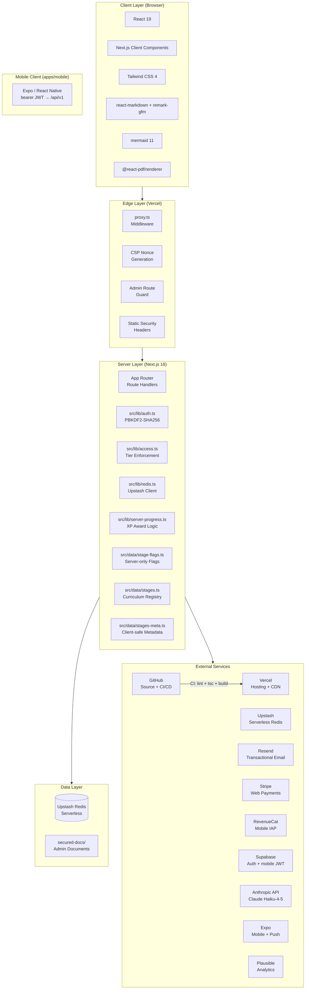
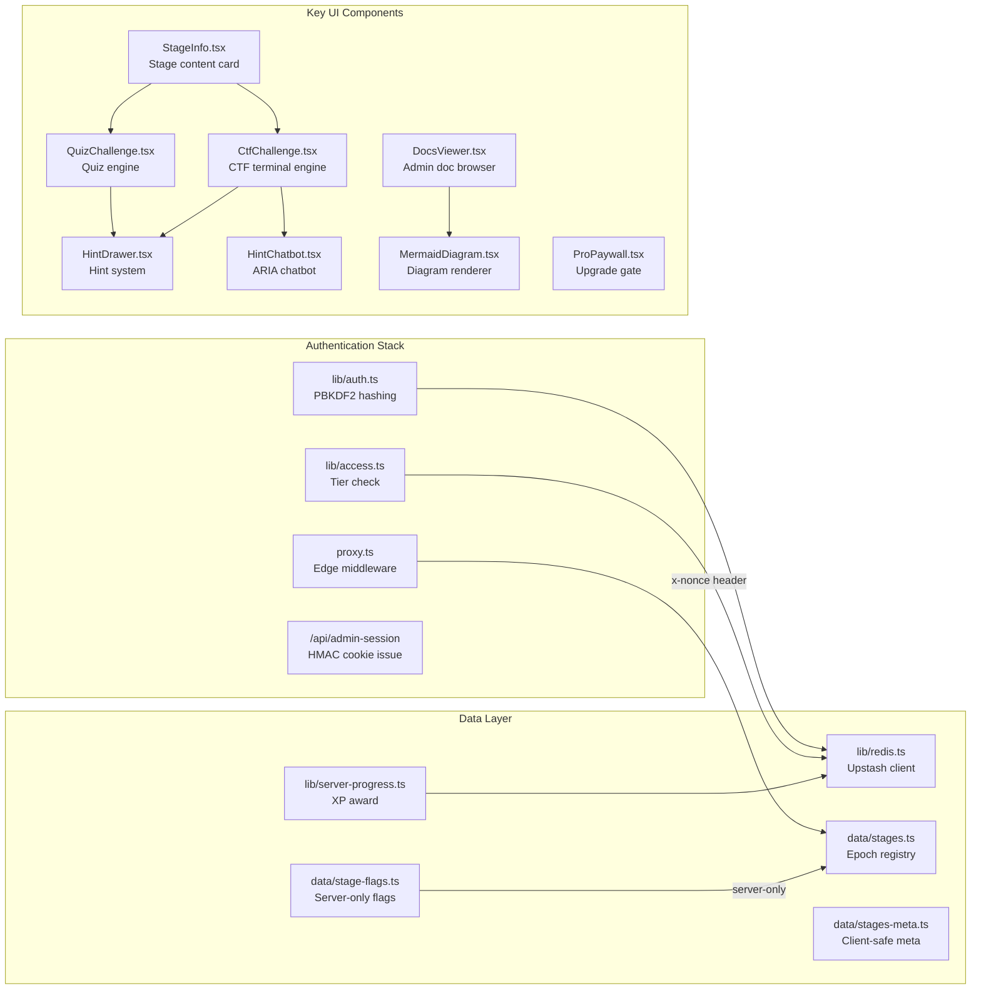
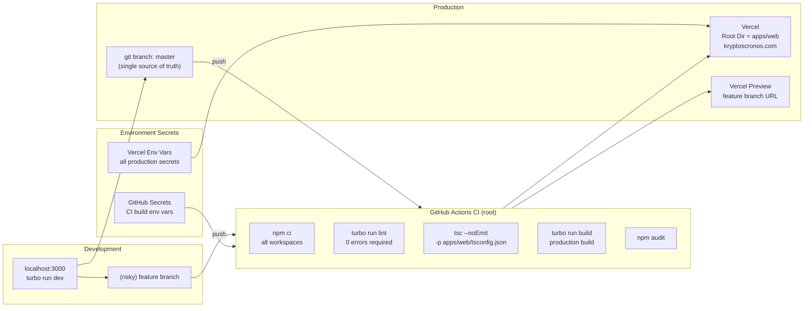

# Technical Bill of Materials — Kryptós CronOS

**Version:** v2.0.0
**Last Updated:** 2026-06-03
**Status:** Current

A complete component registry — every library, service, infrastructure piece, and key source file, with version, role, and dependency linkages.

> **Monorepo note:** the project is a **Turborepo monorepo** (npm workspaces): `apps/web` (Next.js + API, deployed) · `apps/mobile` (Expo / React Native) · `packages/core` (`@kryptos/core` — content + types, formerly `src/data`) · `packages/api-client` (`@kryptos/api-client`). Paths below labeled `src/lib/*` live under **`apps/web/`**; curriculum/content modules live under **`packages/core/src/`**.

---

## System Architecture Overview

---

## npm Dependencies

### Runtime Dependencies

| Package | Version | Role | Used By |
|---|---|---|---|
| `next` | 16.2.6 | App framework — App Router, SSR, API routes, middleware | Entire application |
| `react` | 19.2.4 | UI rendering library | All components |
| `react-dom` | 19.2.4 | React DOM renderer | layout.tsx, pages |
| `@anthropic-ai/sdk` | ^0.98.0 | Claude API client for ARIA chatbot | `/api/hint` |
| `@react-pdf/renderer` | ^4.5.1 | Server-side PDF generation | `/api/progress/certificate` |
| `@upstash/redis` | ^1.38.0 | Serverless Redis HTTP client | `src/lib/redis.ts` |
| `react-markdown` | ^10.1.0 | Markdown rendering in admin docs viewer | `DocsViewer.tsx` |
| `remark-gfm` | ^4.0.1 | GitHub Flavored Markdown plugin (tables, task lists) | `DocsViewer.tsx` |
| `mermaid` | ^11.15.0 | Client-side diagram rendering (ERD, flowchart, sequence) | `MermaidDiagram.tsx` |
| `stripe` | ^22.1.1 | Stripe server-side SDK for checkout + webhooks | `/api/stripe/*`, `/api/webhooks/stripe` |
| `@supabase/supabase-js` | ^2.x | Supabase Auth client (web parallel + admin) | `apps/web/src/lib/supabase.ts` |
| `@supabase/ssr` | ^0.x | Supabase SSR cookie client | `apps/web/src/lib/supabase.ts` |
| `jose` | ^5.x | Local JWKS verification of Supabase bearer JWTs (mobile auth) | `apps/web/src/lib/supabase-jwt.ts` |
| `turbo` | ^2.x | Monorepo task runner (build/lint/dev orchestration) | root `turbo.json` |

### Mobile workspace (`apps/mobile`) — key dependencies

| Package | Role |
|---|---|
| `expo` (SDK 56) + `expo-router` | React Native app shell + file-based routing |
| `@supabase/supabase-js` + `@react-native-async-storage/async-storage` | Mobile auth + session persistence |
| `react-native-purchases` | RevenueCat in-app purchases (iOS/Android) |
| `expo-notifications` | Push notification registration + handling |
| `@kryptos/core`, `@kryptos/api-client` | Shared content/types + typed API client |

### Dev Dependencies

| Package | Version | Role |
|---|---|---|
| `typescript` | ^5 | Static typing (strict mode) |
| `@types/node` | ^20 | Node.js type definitions |
| `@types/react` | ^19 | React type definitions |
| `@types/react-dom` | ^19 | React DOM type definitions |
| `tailwindcss` | ^4 | Utility-first CSS framework |
| `@tailwindcss/postcss` | ^4 | Tailwind PostCSS integration |
| `eslint` | ^9 | Linter |
| `eslint-config-next` | 16.2.6 | Next.js ESLint ruleset |
| `playwright` | ^1.60.0 | Browser automation for smoke testing |

---

## External Services

| Service | Tier | Role | Integration Point | Auth Method |
|---|---|---|---|---|
| **Vercel** | Pro | Hosting, CDN, serverless functions, preview URLs | `next.config.ts`, Vercel dashboard | GitHub OAuth + deploy hooks |
| **Upstash Redis** | Pay-as-you-go | All persistent state (users, progress, leaderboard, trophies) | `src/lib/redis.ts` via REST API | `UPSTASH_REDIS_REST_URL` + `UPSTASH_REDIS_REST_TOKEN` |
| **Resend** | Free/Pro | Transactional email — registration alerts, password reset, stage completion | `/api/auth/register`, `/api/forgot-password`, `server-progress.ts` | `RESEND_API_KEY` |
| **Stripe** | Live | Pro subscription payments — monthly ($13.99) and yearly ($99) | `/api/stripe/checkout`, `/api/webhooks/stripe` | `STRIPE_SECRET_KEY`, `STRIPE_WEBHOOK_SECRET` |
| **Anthropic** | API | Claude Haiku-4-5 for ARIA Socratic AI chatbot | `/api/hint` | `ANTHROPIC_API_KEY` |
| **Supabase** | Free | Auth (web parallel + mobile JWT identity source) | `src/lib/supabase.ts`, `src/lib/supabase-jwt.ts` | `SUPABASE_URL`, `SUPABASE_ANON_KEY`, `SUPABASE_SERVICE_ROLE_KEY` |
| **RevenueCat** | Free < $2.5k/mo | Mobile in-app purchases (iOS/Android), unified with Stripe | `/api/webhooks/revenuecat`, mobile `react-native-purchases` | `REVENUECAT_WEBHOOK_AUTH` (+ mobile public keys) |
| **Expo / EAS** | Free | Mobile app build/submit + Expo Push notifications | `apps/mobile`, `/api/push/*` | `CRON_SECRET` (streak cron); `EXPO_PUBLIC_*` (mobile) |
| **Plausible** | ~$9/mo | Privacy-friendly analytics (no cookies/PII) | script in `apps/web` layout; CSP allowlist in `proxy.ts` | none (script tag) |
| **GitHub** | Free | Source control + CI pipeline (Actions) | `.github/workflows/ci.yml` | Repo secrets for env vars |

---

## Key Source Files

### File Registry

| File | Type | Role | Imports |
|---|---|---|---|
| `src/proxy.ts` | Edge Middleware | Admin guard + CSP nonce per request | `next/server` |
| `src/lib/auth.ts` | Server Library | PBKDF2-SHA256 hash + verify; HMAC token sign/verify | `crypto` |
| `src/lib/redis.ts` | Server Library | Upstash Redis client singleton | `@upstash/redis` |
| `src/lib/access.ts` | Server Library (server-only) | `canAccessStage()` — trial expiry + tier check | `redis.ts`, `auth.ts` |
| `src/lib/server-progress.ts` | Server Library | `awardStageInRedis()` — XP, coins, badges, leaderboard | `redis.ts`, `resend` |
| `packages/core/src/stages.ts` | Server Data | Epoch config + full stage array (all 811 stages, 80 epochs) | All epoch files |
| `src/data/stages-meta.ts` | Shared Data | Client-safe listing metadata — no CTF/quiz secrets | `types.ts` |
| `src/data/stage-flags.ts` | Server Data (server-only) | Flag store for CTF validation | `server-only` |
| `src/data/trophies.ts` | Shared Data | 51 trophies across 8 tiers; `dailyShopTrophies()` | — |
| `src/app/stages/epoch-theme.ts` | Shared Config | Accent/border/emoji color per epoch | — |
| `src/components/CtfChallenge.tsx` | Client Component | Full CTF terminal — filesystem sim, fragment system, flag submit | `react` |
| `src/components/QuizChallenge.tsx` | Client Component | Multiple-choice quiz engine | `react` |
| `src/components/StageInfo.tsx` | Client Component | Stage content display + challenge routing | `CtfChallenge`, `QuizChallenge` |
| `src/components/HintDrawer.tsx` | Client Component | Progressive hint system (Pro gate after hint 1) | `react` |
| `src/components/HintChatbot.tsx` | Client Component | ARIA AI chatbot — Socratic, stage-aware, rate-limited | `react` |
| `src/components/ProPaywall.tsx` | Client Component | Upgrade wall when trial expired | `next/link` |
| `src/components/DocsViewer.tsx` | Client Component | Admin documentation browser — tabbed, markdown rendered | `react-markdown`, `MermaidDiagram` |
| `src/components/MermaidDiagram.tsx` | Client Component | Lazy-loaded Mermaid diagram renderer | `mermaid` |
| `src/components/Nav.tsx` | Client Component | Global navigation bar | `next/link` |
| `next.config.ts` | Config | Static security headers, `outputFileTracingIncludes` for secured-docs | — |

---

## API Route Map

> Gameplay/user routes accept **either** the HMAC `session_token` cookie (web) **or** an `Authorization: Bearer <supabase-jwt>` (mobile), resolved by `getAuthedUsername()`. They are also served under `/api/v1/*` (next.config rewrite) for the mobile client.

| Route | Method | Auth | Purpose |
|---|---|---|---|
| `/api/auth/register` | POST | None | Create account, PBKDF2-600k hash, parallel Supabase, set session cookie |
| `/api/auth/login` | POST | None | Verify password (lockout after 5), set session + admin cookies |
| `/api/auth/bootstrap` | POST | Bearer | Provision Redis record for Supabase-only (mobile) accounts |
| `/api/auth/session` | DELETE | Session | Logout — clear cookies |
| `/api/auth/me` | GET | Cookie or Bearer | Return `{username, email, isAdmin, tier}` |
| `/api/admin-session` | POST | Admin secret | Issue HMAC admin cookie |
| `/api/progress` | GET | Session | Fetch user progress from Redis |
| `/api/progress` | POST | Session | Award stage: XP, coins, badges, leaderboard |
| `/api/progress/certificate` | GET | Session | Stream PDF progress report |
| `/api/check-flag` | POST | Session + tier | Validate CTF flag server-side |
| `/api/check-answer` | POST | Session + tier | Validate quiz answer server-side |
| `/api/hint` | POST | Session | ARIA hint via Claude Haiku (rate-limited) |
| `/api/leaderboard` | GET | None | XP rankings (daily/weekly/alltime) |
| `/api/trophies` | GET | Session | Daily shop rotation + owned trophies |
| `/api/trophies` | POST | Session | Buy trophy — atomic supply check |
| `/api/docs/[file]` | GET | Admin cookie | Serve secured-docs file |
| `/api/feedback` | POST | None | Store feedback + email notification |
| `/api/forgot-password` | POST | None | Send reset email (rate-limited) |
| `/api/stripe/checkout` | POST | Session | Create Stripe checkout session (web) |
| `/api/webhooks/stripe` | POST | Stripe signature | Web subscription lifecycle → `proStripe` |
| `/api/webhooks/revenuecat` | POST | RC auth header | Mobile IAP lifecycle → `rcProExpiry` |
| `/api/push/register` | POST/DELETE | Cookie or Bearer | Store/clear Expo push token (`push:tokens`) |
| `/api/push/streak-reminder` | GET | `CRON_SECRET` bearer | Vercel Cron — daily streak-at-risk push |
| `/api/admin/users` | GET | Admin | List all users with stats |
| `/api/admin/set-tier` | POST | Admin | Manually set user tier |
| `/api/admin/set-skin` | POST | Admin | Set user skin/age level |
| `/api/admin/cms/stage/[stageId]` | GET/POST | Admin | Read/write CMS overrides for stages |
| `/api/nda` | GET/POST | Admin/None | Record NDA acceptance; list signatories |

---

## Infrastructure & Deployment

---

## Security Component Inventory

| Control | Implementation | File |
|---|---|---|
| Password hashing | PBKDF2-SHA256, 600k iterations (OWASP 2024); auto-rehash on login | `src/lib/crypto-utils.ts` |
| Bearer auth (mobile) | Supabase JWT verified via local JWKS (`jose`) + `getUser()` fallback; identity from verified email claim | `src/lib/supabase-jwt.ts`, `src/lib/api-auth.ts` |
| Account lockout | 5 failed logins → 15-min lock per username | `/api/auth/login` |
| Session tokens | HMAC-SHA256 signed, HttpOnly cookie, 30-day expiry | `src/lib/auth.ts` |
| Admin tokens | HMAC-SHA256 signed, HttpOnly cookie, 24-hour expiry | `src/lib/auth.ts` |
| Route protection | Edge middleware — admin cookie checked before `/admin/**` | `src/proxy.ts` |
| CSP | Per-request nonce — no `unsafe-inline` in script-src | `src/proxy.ts` |
| HSTS | `max-age=63072000; includeSubDomains; preload` | `next.config.ts` |
| X-Frame-Options | `DENY` | `next.config.ts` |
| X-Content-Type-Options | `nosniff` | `next.config.ts` |
| XP computation | Server-side only — client XP never trusted | `/api/check-flag`, `/api/check-answer` |
| Flag store | `server-only` import guard — never sent to client | `src/data/stage-flags.ts` |
| Tier enforcement | `canAccessStage()` called server-side before flag/answer reveal | `src/lib/access.ts` |
| Rate limiting | Redis INCR + TTL on auth/hint/email endpoints | Multiple API routes |
| Secured docs | Admin HMAC cookie required; files never in `public/` | `/api/docs/[file]` |
