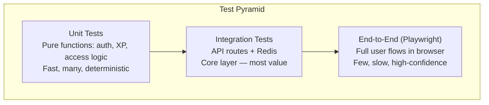

# Testing Strategy — Kryptós CronOS

**Version:** v2.0.0
**Last Updated:** 2026-06-03
**Status:** Current

> Monorepo paths: app/lib under `apps/web/src/`; curriculum/types under `packages/core/src/`. API routes accept the web cookie **or** a mobile Supabase bearer JWT, so auth tests cover both.

---

## 1. Testing Philosophy

Tests exist to catch regressions, not to document code. The test pyramid below reflects the practical constraints of a serverless Next.js + Redis stack: integration tests are the highest-value layer because the unit of risk is an API route interacting with Redis, not an isolated function.



**Guiding principles:**
- No mocking of Redis — integration tests hit a real Upstash test database
- No mocking of the auth stack — session cookies are real HMAC tokens in tests
- Type-check and lint are gates, not tests — they run in CI before any test
- Security-critical paths (flag validation, tier enforcement, admin guard) get dedicated integration test coverage

---

## 2. Test Environment Setup

| Variable | Test Value |
|---|---|
| `UPSTASH_REDIS_REST_URL` | Separate test database URL |
| `UPSTASH_REDIS_REST_TOKEN` | Test database token |
| `ADMIN_SECRET` | Static test secret (`test-admin-secret-32chars!!`) |
| `SESSION_SECRET` | Static test secret (`test-session-secret-32chars!`) |
| `ADMIN_USERNAME` | `testadmin` |
| `STRIPE_SECRET_KEY` | `sk_test_...` Stripe test key |
| `ANTHROPIC_API_KEY` | Not required for most tests (hint endpoint mocked) |

**Test database isolation:** Use a dedicated Upstash Redis database for testing. Prefix all test keys with `test:` or flush between test suites using `FLUSHDB`.

---

## 3. Unit Tests

**Target:** Pure functions with no external dependencies.

### 3.1 Auth Libraries (`src/lib/crypto-utils.ts`, `src/lib/server-session.ts`, `src/lib/api-auth.ts`, `src/lib/supabase-jwt.ts`)

| Test | Description |
|---|---|
| `hashPassword` returns different salts each call | Salt randomness verified |
| `hashPassword` uses 600k iterations | OWASP 2024 parameter |
| `verifyPassword` returns true for matching password | Round-trip hash/verify |
| `verifyPassword` returns false for wrong password | Negative case |
| Legacy hash (100k/310k) re-hashed to 600k on login | Transparent migration |
| `signToken` produces `username:hex` format | Token format validation |
| `verifyToken` returns true for valid token | HMAC verify round-trip |
| `verifyToken` returns false for tampered token | Security — bit flip detection |
| `verifyToken` uses `timingSafeEqual` | Timing attack resistance |
| `verifySupabaseJwt` accepts a valid JWKS-signed token | Bearer happy path |
| `verifySupabaseJwt` rejects a forged/expired token | Bearer negative case |
| Bearer identity resolved from email claim, not `user_metadata` | Spoof-safety |
| `getAuthedUsername` resolves cookie OR bearer | Dual-client resolver |

### 3.2 Access Library (`src/lib/access.ts`)

| Test | Description |
|---|---|
| Admin username always returns `canAccess: true` | Admin bypass |
| Pro tier returns `canAccess: true` regardless of age | Paid access |
| Trial within 7 days returns `canAccess: true` | Trial window |
| Trial expired (>7 days) + free tier returns `canAccess: false` | Paywall trigger |
| `createdAt` exactly 7 days ago is still in trial | Boundary condition |

### 3.2b Tier Entitlement (`src/lib/access.ts` → `getUserTier`)

| Test | Description |
|---|---|
| `proStripe` active → Pro | Web subscription source |
| `rcProExpiry` future-dated → Pro | Mobile IAP source |
| `voucherExpiry` future-dated → Pro | Voucher source |
| Only revokes to free when no source active | Multi-source non-clobber |
| One source expiring while another active keeps Pro | Cross-platform safety |

### 3.3 Trophy Logic (`packages/core/src/trophies.ts`)

| Test | Description |
|---|---|
| `dailyShopTrophies(username, day)` returns exactly 10 | Count invariant |
| Same user + same day always returns same 10 trophies | Determinism |
| Different users on same day return different selections | Per-user uniqueness |
| Same user on different days returns different selections | Daily rotation |
| No trophy appears twice in a user's daily set | Deduplication |

### 3.4 XP Computation

| Test | Description |
|---|---|
| `STAGE_XP[stageId]` returns expected XP for known stages | Map integrity |
| Unknown stageId returns 0 or throws (not undefined) | Defensive handling |
| XP is always positive | Value constraint |

---

## 4. Integration Tests

**Target:** API routes with real Redis (test database). Each test cleans up its own Redis keys.

**Tooling:** Node.js test runner (`node --test`) or Vitest with `fetch()` against a local Next.js server (`next start` in test mode).

### 4.1 Authentication Routes

| Test | Route | Verify |
|---|---|---|
| Successful registration | POST /api/auth/register | 200, session cookie set, `user:{u}` in Redis |
| Duplicate username | POST /api/auth/register | 409 |
| Registration rate limit | POST /api/auth/register (6× same IP) | 429 on 6th |
| Successful login | POST /api/auth/login | 200, cookies set |
| Wrong password | POST /api/auth/login | 401 |
| Login rate limit | POST /api/auth/login (6× same IP) | 429 |
| Logout clears cookies | DELETE /api/auth/session | Cookies absent in response |
| Auth/me with valid cookie | GET /api/auth/me | 200, correct payload |
| Auth/me with valid bearer JWT | GET /api/auth/me (Authorization header) | 200, correct payload |
| Auth/me with bogus bearer | GET /api/auth/me | 401 |
| Auth/me without cookie | GET /api/auth/me | 401 |
| Account lockout after 5 fails | POST /api/auth/login (×6) | 423 on 6th |
| Bootstrap provisions Supabase-only account | POST /api/auth/bootstrap (bearer) | `user:{u}` + `email:{e}` in Redis |
| `/api/v1/*` reaches the same handler | GET /api/v1/auth/me | identical to `/api/auth/me` |

### 4.2 Progress Routes

| Test | Route | Verify |
|---|---|---|
| GET progress returns empty for new user | GET /api/progress | `{ xp: 0, stages: [] }` |
| POST awards XP for new stage | POST /api/progress | XP in Redis matches STAGE_XP |
| POST deduplicates completed stage | POST /api/progress (twice) | XP awarded only once |
| Leaderboard updated after POST | GET /api/leaderboard | User rank reflects new XP |
| Client-supplied XP ignored | POST /api/progress `{ stageId, xp: 99999 }` | Only server XP used |

### 4.3 Flag/Answer Validation

| Test | Route | Verify |
|---|---|---|
| Correct flag returns success | POST /api/check-flag | `{ success: true }` |
| Wrong flag returns failure | POST /api/check-flag | `{ success: false }` |
| Correct answer returns correct | POST /api/check-answer | `{ correct: true }` |
| Flag check blocked without session | POST /api/check-flag (no cookie) | 401 |
| Flag check blocked for expired trial | POST /api/check-flag | 403 |
| Flag value not in response body | POST /api/check-flag | `flag` field absent from response |

### 4.4 Trophy Routes

| Test | Route | Verify |
|---|---|---|
| Daily shop returns 10 trophies | GET /api/trophies | `daily.length === 10` |
| Purchase deducts coins | POST /api/trophies | Coins decreased in Redis |
| Supply exhausted returns 409 | POST /api/trophies | 409, counter rolled back |
| Duplicate purchase returns 409 | POST /api/trophies (twice) | 409 on second |
| Out-of-rotation purchase blocked | POST /api/trophies (non-daily) | 400 |

### 4.5 Stripe Webhook

| Test | Route | Verify |
|---|---|---|
| Valid `checkout.session.completed` | POST /api/webhooks/stripe | `tier: pro` + `proStripe` in Redis |
| Valid `subscription.deleted` (no other source) | POST /api/webhooks/stripe | `tier: free` in Redis |
| `subscription.deleted` while RevenueCat active | POST /api/webhooks/stripe | stays `tier: pro` (multi-source) |
| Invalid signature rejected | POST /api/webhooks/stripe | 400 |

### 4.5b RevenueCat Webhook & Push

| Test | Route | Verify |
|---|---|---|
| Valid grant event | POST /api/webhooks/revenuecat | `tier: pro` + `rcProExpiry` set |
| Bad/missing auth header | POST /api/webhooks/revenuecat | 401 |
| Register push token | POST /api/push/register | token stored in `push:tokens` |
| Streak cron without `CRON_SECRET` | GET /api/push/streak-reminder | 401 |

---

## 5. End-to-End Tests (Playwright)

**Target:** Full user flows in a Chromium browser against the dev server (`npm run dev`).

**Location:** `.claude/skills/run-cyberquest/` (existing Playwright smoke driver)

### 5.1 Core User Flow

```
1. Navigate to homepage → verify hero content
2. Click Register → submit valid credentials
3. Verify redirect to /stages
4. Click on "Our First Journey" epoch card
5. Navigate to bt-01 stage
6. Complete CTF challenge with correct flag
7. Verify XP award toast/notification
8. Navigate to /leaderboard → verify user appears
```

### 5.2 Paywall Flow

```
1. Create user with createdAt = 8 days ago (Redis backdating in test)
2. Navigate to any stage
3. Verify ProPaywall component renders (not stage content)
4. Click "Upgrade Monthly"
5. Verify redirect to Stripe checkout URL
```

### 5.3 Admin Flow

```
1. Login as admin user
2. Navigate to /admin
3. Verify user table renders with data
4. Navigate to /admin/docs
5. Verify DocsViewer loads and Architecture tab shows index table
6. Click a doc tab → verify Mermaid diagrams render as SVG
```

### 5.4 Trophy Purchase Flow

```
1. Login with user having sufficient coins (set via Redis directly)
2. Navigate to /shop → Treasures tab
3. Verify daily rotation shows 10 trophies
4. Click Buy on first trophy
5. Verify trophy appears in /trophies vault
6. Verify coin balance decreased
```

---

## 6. User Acceptance Testing (UAT)

**Owner:** Ajax Bolotin (Product Owner)  
**Environment:** Vercel Preview URL (feature branch) for risky changes; otherwise local + production smoke after a `master` push

### UAT Process

1. All UAC criteria in `USER_ACCEPTANCE_CRITERIA.md` are the acceptance checklist
2. Each criterion is tested manually on the preview URL before merging to master
3. Security UAC (UAC-SEC-01 through UAC-SEC-04) tested using browser devtools
4. Flag/answer server-side enforcement tested by making direct API calls via curl/Postman

### UAT Sign-off Criteria

Before any production deploy:
- [ ] All auth flows complete without error
- [ ] CTF flag validation correct on ≥3 different stages
- [ ] Quiz answer validation correct on ≥3 different stages
- [ ] ProPaywall appears for trial-expired account
- [ ] Stripe checkout redirects correctly (test mode)
- [ ] Admin dashboard loads with real user data
- [ ] DocsViewer loads all Architecture docs with Mermaid diagrams rendered
- [ ] Leaderboard updates after stage completion
- [ ] No console errors on homepage, /stages, /leaderboard

---

## 7. Regression Testing

**Trigger:** On every PR targeting master; on every merge to master.

### Automated Regression Checklist (CI)

```yaml
# .github/workflows/ci.yml — gates in order (run from monorepo root)
1. npm ci                                              # all workspaces
2. npm run lint                                        # turbo → 0 ESLint errors
3. npx tsc --noEmit --skipLibCheck -p apps/web/tsconfig.json  # 0 TS errors
4. npm run build                                       # turbo production build
5. npm audit                                           # no critical CVEs
```

### Manual Regression Areas (run after significant changes)

| Area | Check |
|---|---|
| Auth stack | Login, register, logout, password reset all work |
| Stage pages | At least one CTF and one quiz stage complete successfully |
| Leaderboard | XP reflected after stage completion |
| Admin dashboard | User table, tier toggle, docs viewer all functional |
| Mobile layout | Homepage and stage map render correctly at 375px |
| CSP | No CSP violations in browser console |
| ARIA chatbot | Response returned within 10s; no flag revealed |

---

## 8. Security Testing

| Test | Method | Frequency |
|---|---|---|
| XSS via stage content | Submit `<script>` in quiz answer; verify no execution | Per release |
| CSRF on state-changing routes | POST without session cookie → verify 401 | Per release |
| Admin route bypass | Access `/admin` without admin cookie → verify 302 | Per release |
| Flag in client bundle | `grep` compiled JS for known flag values | Per release |
| Rate limit enforcement | Scripted 10+ rapid requests to auth endpoints | Per release |
| Secured docs direct access | `GET /secured-docs/README.md` → verify 404 | Per release |
| SQL injection (N/A) | Not applicable — no SQL database | — |
| Stripe signature bypass | Fake webhook without `Stripe-Signature` → verify 400 | Per release |
| RevenueCat webhook auth bypass | POST without/with wrong Authorization → verify 401 | Per release |
| Bearer JWT forgery | Self-signed/expired Supabase JWT → verify 401 | Per release |
| CORS for `/api` | Disallowed origin not reflected; preflight 204 | Per release |

Security tests are run as part of the deploy skill's 6-pass audit documented in `CICD_PIPELINE.md`.

---

## 9. Performance Testing

| Metric | Tool | Target |
|---|---|---|
| Homepage FCP | Vercel Analytics / Lighthouse | < 2s |
| Stage page load | Lighthouse | < 2s |
| `/api/progress` GET | curl timing | < 300ms P95 |
| `/api/check-flag` POST | curl timing | < 500ms P95 |
| `/api/leaderboard` GET | curl timing | < 500ms P95 |
| PDF certificate generation | `time curl /api/progress/certificate` | < 5s |

Performance tests are run manually pre-launch and after significant changes to Redis-heavy API routes.
